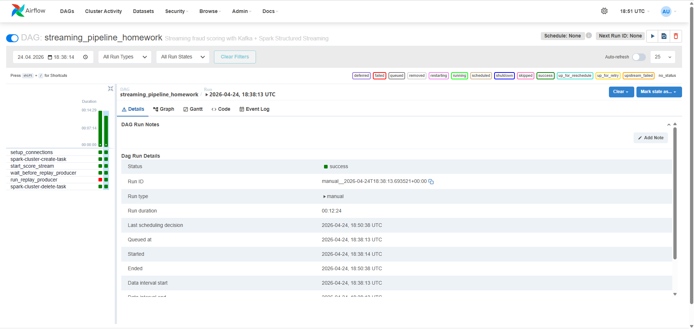
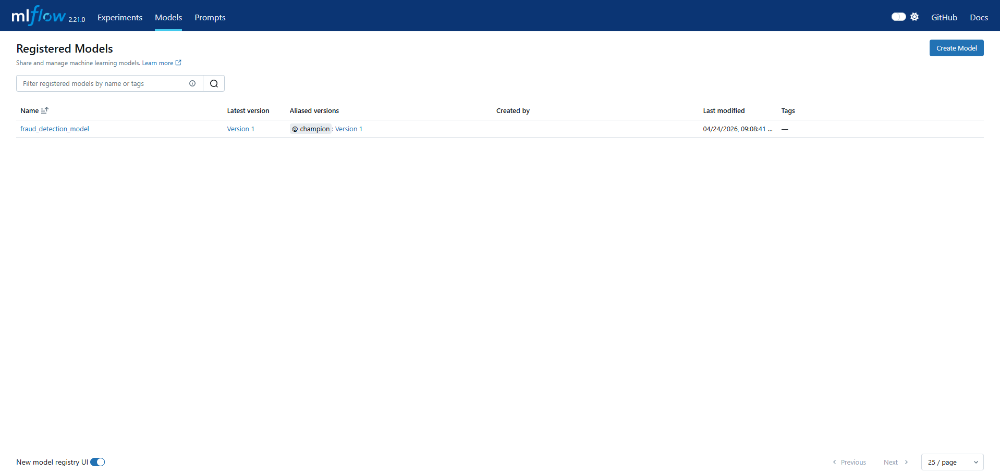
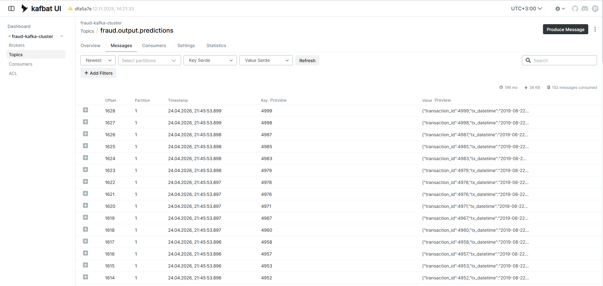

# OTUS. Асинхронный потоковый режим

Проект реализует end-to-end потоковый MLOps-пайплайн для скоринга фродовых транзакций в Yandex Cloud. Ретроспективные данные автоматически публикуются в Apache Kafka, после чего Spark Structured Streaming читает входной поток, загружает актуальную модель из MLflow Model Registry по алиасу `@champion`, рассчитывает скор для каждой транзакции и записывает результаты в выходной Kafka topic. Оркестрация выполняется через Apache Airflow: DAG автоматически создаёт Dataproc-кластер, запускает streaming job и producer, а после завершения обработки удаляет кластер. Для хранения скриптов, входных файлов, checkpoint’ов и окружения используется S3-совместимый Object Storage. Таким образом, проект демонстрирует полностью автоматизированный production-like сценарий потокового inference, объединяющий Kafka, Spark, MLflow, Airflow и облачную инфраструктуру в единый воспроизводимый пайплайн.

В ходе нагрузочного тестирования producer последовательно запускался с возрастающей интенсивностью публикации сообщений в Kafka. По результатам эксперимента было установлено, что при фактической скорости потока как минимум до ~4.3 тыс. сообщений в секунду роста очереди необработанных сообщений по данным Kafka UI не наблюдалось. Это означает, что текущая конфигурация пайплайна выдерживает не менее указанного уровня нагрузки без заметного накопления lag. Точную точку начала устойчивого роста очереди в рамках выполненного эксперимента определить не удалось, поэтому полученный результат следует интерпретировать как нижнюю границу пропускной способности системы.

## Компоненты проекта

Проект состоит из следующих компонентов:

1. **Инфраструктура** (директория `/infra`):
   - Кластер Airflow - оркестрация процессов
   - Кластер Kafka — потоковая передача транзакций и результатов скоринга
   - Сервер MLflow - отслеживание экспериментов и хранение моделей
   - Кластер PostgreSQL - хранение метаданных экспериментов MLflow
   - S3-хранилище - хранение артефактов экспериментов и исходных данных
   - Сеть, подсеть и другие ресурсы Yandex Cloud

2. **Модель** (директория `/src`):
   - PySpark-скрипт для обучения модели с логикой сравнения и регистрации моделей в MLflow

3. **Оркестрация** (директория `/dags`):
   - Airflow DAG для регулярного запуска процесса обучения на временном кластере Dataproc

1. **Вспомогательные скрипты** (директория `/scripts`):
   - Генерация демонстрационных данных для обучения
   - Создание архива виртуального окружения

## Архитектура решения

1. **Исходные данные** и служебные файлы хранятся в S3-совместимом Object Storage
2. **Apache Kafka** используется как транспортный слой для потоковой передачи транзакций: producer публикует события во входной topic, а результаты скоринга записываются в выходной topic
3. **Airflow DAG** автоматически создает временный кластер Dataproc, запускает streaming job и producer, а после завершения удаляет кластер
4. **PySpark / Spark Structured Streaming** запускается на кластере Dataproc, читает поток из Kafka, выполняет подготовку признаков и применяет модель к входящим транзакциям
5. **MLflow** отслеживает эксперименты, хранит модели и метрики, а также используется как Model Registry для загрузки актуальной версии модели
6. **PostgreSQL** хранит метаданные экспериментов и моделей MLflow

## Начало работы

### Предварительные требования

- [Terraform](https://www.terraform.io/downloads.html) >= 1.0.0
- [Yandex Cloud CLI](https://cloud.yandex.ru/docs/cli/quickstart)
- [Python](https://www.python.org/downloads/) == 3.11
- [s3cmd](https://s3tools.org/download)

### Шаг 1: Создание инфраструктуры с помощью Terraform

```bash
cd infra
terraform init
terraform apply

# make
make init
make apply
```

После создания инфраструктуры, Terraform выведет значения выходных переменных, включая URL сервера MLflow и другие необходимые параметры.

### Шаг 2: Формирование датасета для обучения модели

Обучающий набор данных формируется из файла 2019-08-22.txt в виде сэмпла на 100 000 строк без перемешивания.
Для этого необходимо выполнить скрипт:

```bash
{
  head -n 1 data/input_data/2019-08-22.txt
  tail -n +2 data/input_data/2019-08-22.txt | head -n 100000
} > data/input_data/2019-08-22-sample-100k.txt
```

Скрипт сохранит файл в директории data/input_data.

### Шаг 3: Подготовка и загрузка ресурсов в S3-хранилище

Вы можете использовать команды Makefile для загрузки необходимых ресурсов:

```bash
# Создать и загрузить виртуальное окружение
make create-venv-archive
make upload-venv-to-bucket

# Загрузить исходный код модели
make upload-src-to-bucket

# Загрузить DAG файлы
make upload-dags-to-bucket

# Загрузить данные в S3
make upload-data-to-bucket

# Или выполнить полное развертывание одной командой
make deploy-full
```

### Шаг 4: Настройка Airflow

1. Загрузите переменные окружения в UI Airflow из файла variables.json.

2. Включите DAG в веб-интерфейсе Airflow.

### Шаг 5: Мониторинг и получение результатов

Вы можете проверить список экземпляров виртуальных машин:
```bash
make instance-list
```

Для мониторинга кластера Airflow используйте:
```bash
make airflow-cluster-mon
```

Чтобы загрузить результаты обработки из S3-хранилища:
```bash
make download-output-data-from-bucket
```

## Работа с MLflow

После запуска MLflow-сервера вы можете открыть его веб-интерфейс по адресу, который был выведен после выполнения `terraform apply`.

В интерфейсе MLflow вы сможете:
- Просматривать эксперименты и их метрики
- Сравнивать модели между собой
- Загружать зарегистрированные модели

## Структура проекта

```
/
├── dags/                  # Airflow DAGs
│   └── training_pipeline_homework.py
├── data/                  # Данные для обучения и результаты
│   ├── input_data/        # Входные данные
│   └── output_data/       # Результаты работы модели
|── images/                # Изображения с демонстрацией работы
├── infra/                 # Terraform конфигурация
├── scripts/               # Вспомогательные скрипты
│   └── create_venv_archive.sh
├── src/                   # Исходный код модели
|   └── streaming/
|       └── replay_to_kafka_spark.py
|       └── replay_to_kafka.py
│   └── ab_test_fraud.py
|   └── common_fraud.py
|   └── train_fraud_detection.py    
├── utils/                 # Утилиты
│   └── push_secrets_to_github_repo.py
├── venvs/                 # Архивы виртуальных окружений
├── .env                   # Файл с переменными окружения
├── Makefile               # Makefile для автоматизации задач
├── requirements.txt       # Зависимости Python
└── README.md              # Это файл
```

## Синхронизация с удаленным окружением

Для работы с удаленным окружением используйте:

```bash
# Синхронизация локального кода с удаленным
make sync-repo

# Получение актуального .env файла с удаленного сервера
make sync-env
```

## Демонстрация работы систем Apache Airflow, MLFow и Apache Kafka представлена на снимках экрана



